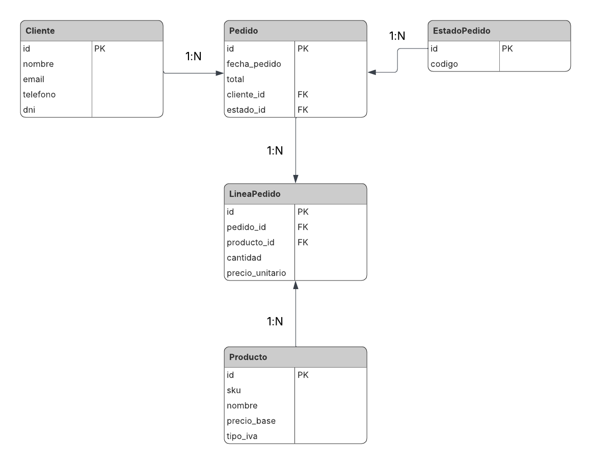

# MiniERP - Sistemas de Gestión Empresarial

## Tabla de Contenidos

- [Descripción](#descripción)
- [Tecnologías](#tecnologías)
- [Instalación y Uso](#instalación-y-uso)
- [Fase 1: Análisis y Modelado de Datos](#fase-1-análisis-y-modelado-de-datos)
  - [1.1 Justificación del Modelo](#11-justificación-del-modelo)
  - [1.2 Relaciones y Cardinalidades](#12-relaciones-y-cardinalidades)
  - [1.3 Diagrama Entidad-Relación](#13-diagrama-entidad-relación)
- [Fase 2: Implementación en Django](#fase-2-implementación-en-django)
  - [2.1 Estructura del Proyecto](#21-estructura-del-proyecto)
  - [2.2 Modelos Implementados](#22-modelos-implementados)
  - [2.3 Decisiones de Diseño](#23-decisiones-de-diseño)
- [Fase 3: Panel de Administración](#fase-3-panel-de-administración)
  - [3.1 Configuración del Admin](#31-configuración-del-admin)

## Descripción

Este proyecto es un sistema básico de gestión empresarial (ERP) desarrollado con Django. Permite gestionar clientes, productos, pedidos y sus líneas a través del panel de administración de Django.

## Tecnologías

- Python 3.13
- Django 6.0.1
- SQLite3

## Instalación y Uso
```bash
# Activar entorno virtual
.\venv\Scripts\activate

# Aplicar migraciones
python manage.py migrate

# Crear superusuario
python manage.py createsuperuser

# Ejecutar servidor
python manage.py runserver
```
Acceder al panel de administración en: http://127.0.0.1:8000/admin

---

## Fase 1: Análisis y Modelado de Datos

### 1.1 Justificación del Modelo

He organizado los modelos en dos categorías:

#### Datos Maestros (en app `core`)

Son los datos estables que no cambian frecuentemente:

- **Cliente**: Información de los clientes (nombre, email, DNI, teléfono).
- **Producto**: Catálogo de productos con su SKU, precio base y tipo de IVA.
- **EstadoPedido**: Estados posibles de un pedido (BORRADOR, CONFIRMADO, FACTURADO, COBRADO).

#### Datos Transaccionales (en app `ventas`)

Son los datos que representan operaciones del día a día:

- **Pedido**: La cabecera del pedido con fecha, total y referencias al cliente y estado.
- **LineaPedido**: El detalle de cada producto vendido en un pedido (cantidad y precio aplicado).

### 1.2 Relaciones y Cardinalidades

Las relaciones entre los modelos son:

1. **Cliente → Pedido** (1:N)
   - Un cliente puede tener muchos pedidos
   - Política: `RESTRICT` (no se puede borrar un cliente con pedidos)

2. **EstadoPedido → Pedido** (1:N)
   - Un estado puede estar en muchos pedidos
   - Política: `RESTRICT` (no se puede borrar un estado en uso)

3. **Pedido → LineaPedido** (1:N)
   - Un pedido tiene muchas líneas
   - Política: `CASCADE` (si se borra el pedido, se borran sus líneas)

4. **Producto → LineaPedido** (1:N)
   - Un producto puede estar en muchas líneas de diferentes pedidos
   - Política: `RESTRICT` (no se puede borrar un producto con histórico de ventas)

### 1.3 Diagrama Entidad-Relación



## Fase 2: Implementación en Django

### 2.1 Estructura del Proyecto
```
sistemas-gestion-empresarial-aa1/
├── manage.py
├── db.sqlite3
├── minierp/              # Configuración del proyecto
│   ├── settings.py
│   ├── urls.py
│   └── wsgi.py
├── core/                 # App para modelos maestros
│   ├── models.py
│   ├── admin.py
│   └── migrations/
├── ventas/               # App para modelos transaccionales
│   ├── models.py
│   ├── admin.py
│   └── migrations/
└── README.md
```

### 2.2 Modelos Implementados

#### Modelos en `core/models.py`:

- **Cliente**: Con campos `nombre`, `email` (UNIQUE), `telefono`, `dni` (UNIQUE)
- **Producto**: Con campos `sku` (UNIQUE), `nombre`, `precio_base`, `tipo_iva`
- **EstadoPedido**: Con campo `codigo` (UNIQUE) usando CHOICES para los estados

#### Modelos en `ventas/models.py`:

- **Pedido**: Con `fecha_pedido`, `total`, `cliente` (FK), `estado` (FK)
- **LineaPedido**: Con `pedido` (FK), `producto` (FK), `cantidad`, `precio_unitario`
  - Incluye un CHECK constraint para asegurar que `cantidad > 0`

### 2.3 Decisiones de Diseño

**Claves primarias:** Uso el `id` automático de Django en todos los modelos.

**Políticas ON_DELETE:**
- `RESTRICT` en Cliente, Producto y EstadoPedido: Para proteger el histórico
- `CASCADE` en LineaPedido: Las líneas no tienen sentido sin su pedido

**Constraints:**
- Campos UNIQUE: `dni`, `email`, `sku`, `codigo`
- CHECK constraint: `cantidad > 0` en LineaPedido

## Fase 3: Panel de Administración

### 3.1 Configuración del Admin

He registrado todos los modelos en sus respectivos archivos `admin.py`:

**En `core/admin.py`:**
- ClienteAdmin: Muestra nombre, email, teléfono y DNI
- ProductoAdmin: Muestra SKU, nombre, precio e IVA
- EstadoPedidoAdmin: Muestra el código del estado

**En `ventas/admin.py`:**
- PedidoAdmin: Muestra id, fecha, total, cliente y estado
- LineaPedidoAdmin: Muestra id, pedido, producto, cantidad y precio
